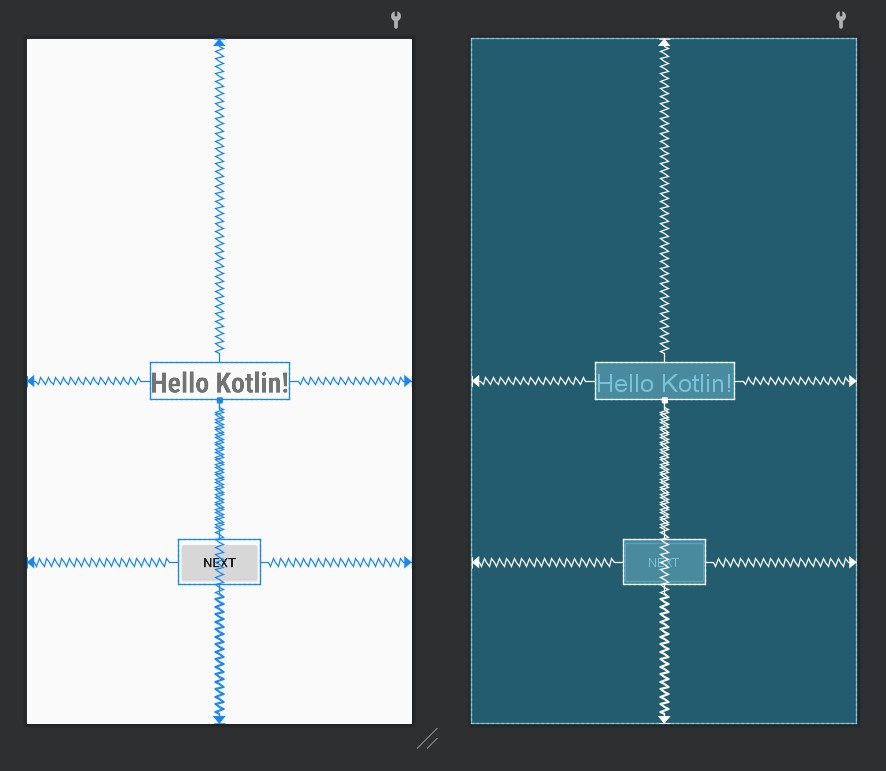
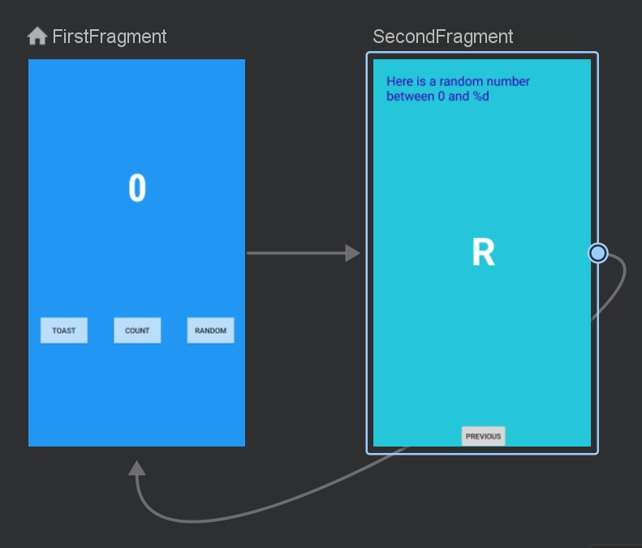

# 实验2_1 实现第一个kotlin应用
## 1 创建工程
### 1.1 新建一个Basic Activity

### 1.2在模拟器上运行应用程序
创建api版本33的手机模拟器  
  
等待gradle构建完毕，运行程序，效果如下  

## 2 通过布局编辑器修改布局
### 2.1 修改文本
修改strings.xml文件，改变显示内容
```xml
<string name="hello_first_fragment">Hello KotLin!</string>
```
修改fragment_first.xml，在TextView中添加如下属性，改变文本样式
```xml
android:textColor="@android:color/darker_gray"
android:textStyle="bold"
android:textSize="30sp"
android:fontFamily="sans-serif-condensed"
```
重新运行程序，显示效果如下  

### 2.2 修改按钮和约束
#### 修改原约束
将next按钮与TextView之间的约束链删除，将TextView的底部约束至屏幕底部，next按钮的顶端约束至TextView底部  
  
#### 添加新按钮及约束
从Palette面板中拖拽两个Button到屏幕上，将两个按钮的底部约束至屏幕底部，顶端约束至TextView底部，左右分别约束至屏幕左右两端  

## 3 更新按钮和文本框的外观
### 3.1 修改资源文件
在string.xml中新增3个button所需要用到的字符串资源，并将TextView对应的字符串文本修改为0
```xml
<string name="toast_button_text">Toast</string>
<string name="random_button_text">Random</string>
<string name="count_button_text">Count</string>

<string name="hello_first_fragment">0</string>
```
在color.xml中新增2个颜色资源
```xml
<color name="screenBackground">#2196F3</color>
<color name="buttonBackground">#BBDEFB</color>
```
### 3.2 设置外观与位置
在fragment_first.xml中修改屏幕背景色为
```xml
android:background="@color/screenBackground"
```
设置每个按钮的背景色为
```xml
android:background="@color/buttonBackground"
```
**注意：** 要使对按钮背景色的修改生效，需要在theme.xml中修改style值为
```xml
<style name="Theme.MyFirstApp" parent="Theme.MaterialComponents.DayNight.DarkActionBar.Bridge">
```
利用属性面板的Constraint Widget，将Toast按钮与屏幕的左边距和Random按钮与屏幕的右边距设置为24dp  
  
将TextView的垂直偏移设置为0.3  
  
移除TextView的背景颜色，设置TextView的文本颜色为color/white，并增大字体大小至72sp  
修改完毕后的Fragment_first.xml的代码如下  
```xml
<?xml version="1.0" encoding="utf-8"?>
<androidx.constraintlayout.widget.ConstraintLayout xmlns:android="http://schemas.android.com/apk/res/android"
    xmlns:app="http://schemas.android.com/apk/res-auto"
    xmlns:tools="http://schemas.android.com/tools"
    android:layout_width="match_parent"
    android:layout_height="match_parent"
    android:background="@color/screenBackground"
    tools:context=".FirstFragment">

    <TextView
        android:id="@+id/textview_first"
        android:layout_width="wrap_content"
        android:layout_height="wrap_content"
        android:fontFamily="sans-serif-condensed"
        android:text="@string/hello_first_fragment"
        android:textColor="@android:color/white"
        android:textStyle="bold"
        android:textSize='72sp'
        app:layout_constraintBottom_toBottomOf="parent"
        app:layout_constraintEnd_toEndOf="parent"
        app:layout_constraintStart_toStartOf="parent"
        app:layout_constraintTop_toTopOf="parent"
        app:layout_constraintVertical_bias="0.30" />

    <Button
        android:id="@+id/count_button"
        android:layout_width="wrap_content"
        android:layout_height="wrap_content"
        android:text='@string/count_button_text'
        android:background="@color/buttonBackground"
        app:layout_constraintBottom_toBottomOf="parent"
        app:layout_constraintEnd_toEndOf="parent"
        app:layout_constraintStart_toStartOf="parent"
        app:layout_constraintTop_toBottomOf="@+id/textview_first" />

    <Button
        android:id="@+id/toast_button"
        android:layout_width="wrap_content"
        android:layout_height="wrap_content"
        android:background="@color/buttonBackground"
        android:text="@string/toast_button_text"
        app:layout_constraintBottom_toBottomOf="parent"
        app:layout_constraintEnd_toStartOf="@+id/count_button"
        app:layout_constraintStart_toStartOf="parent"
        app:layout_constraintTop_toBottomOf="@+id/textview_first" />

    <Button
        android:id="@+id/random_button"
        android:layout_width="wrap_content"
        android:layout_height="wrap_content"
        android:background="@color/buttonBackground"
        android:text="@string/random_button_text"
        app:layout_constraintBottom_toBottomOf="parent"
        app:layout_constraintEnd_toEndOf="parent"
        app:layout_constraintStart_toEndOf="@+id/count_button"
        app:layout_constraintTop_toBottomOf="@+id/textview_first" />
</androidx.constraintlayout.widget.ConstraintLayout>
```
最终效果如下  

## 4 修改SecondFragment的布局
### 4.1 新增TextView
修改Fragment_second.xml文件，删除TextView和Button之间的约束链，拖动新的TextView至屏幕中间，id设置为 **@+id/textview_random**，用于显示随机数，将其左右约束至屏幕左右端，顶端约束至原本TextView的底部，底端约束至Button的顶部，并设置垂直偏移量为0.45  
  
### 4.2 修改资源文件
在string.xml文件中添加
```xml
<string name="random_heading">Here is a random number between 0 and %d</string>
```
在color.xml文件中添加
```xml
<color name="colorPrimaryDark">#3700B3</color>
<color name="screenBackground2">#26C6DA</color>
```
### 4.3 修改文本内容和样式
①设置textview_random的字体颜色textColor属性为 **@android:color/white**，textSize为**72sp**，textStyle为**bold**，设置TextView的显示文字为 **“R”**  
②将原本的TextView的id设置为**textview_header**，设置layout_width为**match_parent**，layout_height为**wrap_content**；设置top，strat和end的margin为**24dp**，字体大小为**24sp**，颜色设置为 **@color/colorPrimaryDark**  
③修改fragment_second.xml背景色的属性为**screenBackground2**  
修改完毕后的Fragment_second.xml的代码如下  
```xml
<?xml version="1.0" encoding="utf-8"?>
<androidx.constraintlayout.widget.ConstraintLayout xmlns:android="http://schemas.android.com/apk/res/android"
    xmlns:app="http://schemas.android.com/apk/res-auto"
    xmlns:tools="http://schemas.android.com/tools"
    android:layout_width="match_parent"
    android:layout_height="match_parent"
    android:background="@color/screenBackground2"
    tools:context=".SecondFragment">

    <TextView
        android:id="@+id/textview_header"
        android:layout_width="match_parent"
        android:layout_height="wrap_content"
        android:layout_marginStart="24dp"
        android:layout_marginTop="24dp"
        android:layout_marginEnd="24dp"
        android:text="@string/random_heading"
        android:textColor="@color/colorPrimaryDark"
        android:textSize="24sp"
        app:layout_constraintEnd_toEndOf="parent"
        app:layout_constraintStart_toStartOf="parent"
        app:layout_constraintTop_toTopOf="parent" />

    <Button
        android:id="@+id/button_second"
        android:layout_width="wrap_content"
        android:layout_height="wrap_content"
        android:text="@string/previous"
        app:layout_constraintBottom_toBottomOf="parent"
        app:layout_constraintEnd_toEndOf="parent"
        app:layout_constraintStart_toStartOf="parent" />

    <TextView
        android:id="@+id/textView_random"
        android:layout_width="wrap_content"
        android:layout_height="wrap_content"
        android:text="R"
        android:textColor="@android:color/white"
        android:textSize='72sp'
        android:textStyle='bold'
        app:layout_constraintBottom_toTopOf="@+id/button_second"
        app:layout_constraintEnd_toEndOf="parent"
        app:layout_constraintStart_toStartOf="parent"
        app:layout_constraintTop_toBottomOf="@+id/textview_header"
        app:layout_constraintVertical_bias="0.45" />
</androidx.constraintlayout.widget.ConstraintLayout>
```
最终效果如下  
  
## 5 添加代码完成应用程序交互
### 5.1 启用SafeArgs
①修改Gradle的Project部分，在plugins中添加  
`id 'androidx.navigation.safeargs' version '2.5.3' apply false`  
②修改Gradle的Module部分，在plugins中添加  
`id 'androidx.navigation.safeargs'`  
在dependencies中添加  
`implementation 'androidx.navigation:navigation-fragment-ktx:2.5.3'`  
`implementation 'androidx.navigation:navigation-ui-ktx:2.5.3'`  
③重新构建工程
### 5.2 创建导航动作的参数
打开nav_graph.xml文件，检查两个界面之间的导航关系  
  
查看SecondFragment的属性栏，点击Arguments **+** 符号，在弹出的对话框中，添加参数**myArg**，类型为整型Integer  
  
### 5.3 FirstFragment相关代码
打开FirstFragment.kt源代码文件,找到onViewCreated()方法，该方法在onCreateView方法之后被调用，可以实现组件的初始化。
#### 5.3.1 Toast按钮
在onViewCreated()方法使用绑定机制设置Toast按钮的响应事件
```java
view.findViewById<Button>(R.id.toast_button).setOnClickListener {
    val myToast = Toast.makeText(context, "Hello Toast!", Toast.LENGTH_LONG)
    myToast.show()
}
```
实现效果如下  
  
#### 5.3.2 Count按钮
在onViewCreated()方法使用绑定机制设置Count按钮的响应事件
```java
binding.countButton.setOnClickListener {
    countMe(view)
}
```
其中countMe为自定义方法，以View为参数，每次点击增加数字1，具体代码为：
```java
private fun countMe(view: View){
    val showCountTextView = view.findViewById<TextView>(R.id.textview_first)
    val countString = showCountTextView.text.toString()
    var count = countString.toInt()
    count++
    showCountTextView.text = count.toString()
}
```
#### 5.3.3 Random按钮
在onViewCreated()方法使用绑定机制设置Random按钮的响应事件
```java
binding.randomButton.setOnClickListener {
    //实例化TextView，获取TextView中文本并转换为整数值
    val showCountTextView = view.findViewById<TextView>(R.id.textview_first)
    val currentCount = showCountTextView.text.toString().toInt()

    //将currentCount作为参数传递给actionFirstFragmentToSecondFragment()
    val action = FirstFragmentDirections.actionFirstFragmentToSecondFragment(currentCount)

    //添加导航事件
    findNavController().navigate(action)
}
```
### 5.4 SecondFragment相关代码
打开SecondFragment.kt源代码文件  
导入navArgs包
```java
import androidx.navigation.fragment.navArgs
```
在onViewCreated()代码之前添加一行
```java
val args: SecondFragmentArgs by navArgs()
```
在onViewCreated()内添加以下代码
```java
val count = args.myArg

//将传过来的数放进标题文字里的格式化%d
val countText = getString(R.string.random_heading, count)
view.findViewById<TextView>(R.id.textview_header).text = countText

//生成随机数
val random = java.util.Random()
var randomNumber = 0
if (count > 0){
    randomNumber = random.nextInt(count + 1)
}

//将TextView的文本值修改为生成的随机数
view.findViewById<TextView>(R.id.textView_random).text = randomNumber.toString()
```
### 5.5 程序最终效果
在FirstFragment点击Count按钮使显示的数字加1，点击Random按钮后跳转至SecondFragment，按照FirstFragment显示数字作为上限，随机在SecondFragment上显示一个数字  
运行结果如下  


