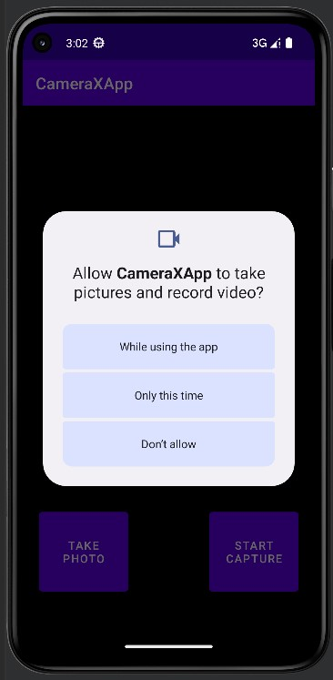

# 实验2_2 构建CameraX应用 {ignore=true}
[TOC]
## 1 创建项目
### 1.1 新建空项目
在Android Studio中创建一个新项目，选择“Empty Activity”,为项目命名，选择Kotlin语言开发，设定最低支持API Level 21（**CameraX所需的最低级别**）  
  
### 1.2 添加Gradle依赖
打开项目的模块（module）的build.Gradle文件，添加CameraX依赖项：
```java
implementation 'androidx.camera:camera-camera2:1.2.1'
implementation 'androidx.camera:camera-core:1.2.1'
implementation 'androidx.camera:camera-lifecycle:1.2.1'
implementation 'androidx.camera:camera-video:1.2.1'
implementation 'androidx.camera:camera-view:1.2.1'
implementation 'androidx.camera:camera-extensions:1.2.1'
```
在此项目中采用ViewBinding，为每个xml布局生成一个绑定类，替代findViewById。故需要在android{}代码块末尾添加如下代码：
```java
buildFeatures {
    viewBinding true
}
```
点击Sync Now重新构建Gradle
### 1.3 创建项目布局
在activity_main布局文件中添加如下代码：
```xml
<?xml version="1.0" encoding="utf-8"?>
<androidx.constraintlayout.widget.ConstraintLayout xmlns:android="http://schemas.android.com/apk/res/android"
    xmlns:app="http://schemas.android.com/apk/res-auto"
    xmlns:tools="http://schemas.android.com/tools"
    android:layout_width="match_parent"
    android:layout_height="match_parent"
    tools:context=".MainActivity">

    <androidx.camera.view.PreviewView
        android:id="@+id/viewFinder"
        android:layout_width="match_parent"
        android:layout_height="match_parent" />

    <Button
        android:id="@+id/image_capture_button"
        android:layout_width="110dp"
        android:layout_height="110dp"
        android:layout_marginBottom="50dp"
        android:layout_marginEnd="50dp"
        android:elevation="2dp"
        android:text="@string/take_photo"
        app:layout_constraintBottom_toBottomOf="parent"
        app:layout_constraintLeft_toLeftOf="parent"
        app:layout_constraintEnd_toStartOf="@id/vertical_centerline" />

    <Button
        android:id="@+id/video_capture_button"
        android:layout_width="110dp"
        android:layout_height="110dp"
        android:layout_marginBottom="50dp"
        android:layout_marginStart="50dp"
        android:elevation="2dp"
        android:text="@string/start_capture"
        app:layout_constraintBottom_toBottomOf="parent"
        app:layout_constraintStart_toEndOf="@id/vertical_centerline" />

    <androidx.constraintlayout.widget.Guideline
        android:id="@+id/vertical_centerline"
        android:layout_width="wrap_content"
        android:layout_height="wrap_content"
        android:orientation="vertical"
        app:layout_constraintGuide_percent=".50" />

</androidx.constraintlayout.widget.ConstraintLayout>
```
在string.xml中添加如下资源代码：
```xml
<string name="app_name">CameraXApp</string>
<string name="take_photo">Take Photo</string>
<string name="start_capture">Start Capture</string>
<string name="stop_capture">Stop Capture</string>
```
布局效果如下图所示：  
  
### 1.4 请求必要权限
打开相机和录制音频都需要对应的权限，故需要打开AndroidManifest.xml文件，将下列权限请求代码添加到application标记之前
```xml
<uses-feature android:name="android.hardware.camera.any" />
<uses-permission android:name="android.permission.CAMERA" />
<uses-permission android:name="android.permission.RECORD_AUDIO" />
<uses-permission android:name="android.permission.WRITE_EXTERNAL_STORAGE"
    android:maxSdkVersion="28" />
```
其中android.hardware.camera.any表示设备可以使用前置摄像头或者后置摄像头，避免了设备没有后置摄像头的情况下，相机无法正常运行的情况。
### 1.5 编写MainActivity.kt代码
在MainActivity.kt中添加以下代码，其中包含将要实现的函数，并在onCreate()中实现了检查相机权限、启动相机和按钮的onClickListener()以及实现cameraExecutor。
```java
typealias LumaListener = (luma: Double) -> Unit

class MainActivity : AppCompatActivity() {
   private lateinit var viewBinding: ActivityMainBinding

   private var imageCapture: ImageCapture? = null

   private var videoCapture: VideoCapture<Recorder>? = null
   private var recording: Recording? = null

   private lateinit var cameraExecutor: ExecutorService

   override fun onCreate(savedInstanceState: Bundle?) {
       super.onCreate(savedInstanceState)
       viewBinding = ActivityMainBinding.inflate(layoutInflater)
       setContentView(viewBinding.root)

       // Request camera permissions
       if (allPermissionsGranted()) {
           startCamera()
       } else {
           ActivityCompat.requestPermissions(
               this, REQUIRED_PERMISSIONS, REQUEST_CODE_PERMISSIONS)
       }

       // Set up the listeners for take photo and video capture buttons
       viewBinding.imageCaptureButton.setOnClickListener { takePhoto() }
       viewBinding.videoCaptureButton.setOnClickListener { captureVideo() }

       cameraExecutor = Executors.newSingleThreadExecutor()
   }

   private fun takePhoto() {}

   private fun captureVideo() {}

   private fun startCamera() {}

   private fun allPermissionsGranted() = REQUIRED_PERMISSIONS.all {
       ContextCompat.checkSelfPermission(
           baseContext, it) == PackageManager.PERMISSION_GRANTED
   }

   override fun onDestroy() {
       super.onDestroy()
       cameraExecutor.shutdown()
   }

   companion object {
       private const val TAG = "CameraXApp"
       private const val FILENAME_FORMAT = "yyyy-MM-dd-HH-mm-ss-SSS"
       private const val REQUEST_CODE_PERMISSIONS = 10
       private val REQUIRED_PERMISSIONS =
           mutableListOf (
               Manifest.permission.CAMERA,
               Manifest.permission.RECORD_AUDIO
           ).apply {
               if (Build.VERSION.SDK_INT <= Build.VERSION_CODES.P) {
                   add(Manifest.permission.WRITE_EXTERNAL_STORAGE)
               }
           }.toTypedArray()
   }
}
```
运行应用，可以发现程序请求使用摄像头和麦克风：  

## 2 实现preview用例
在上一步中已经实现了相机的调用，但此时屏幕中还看不到任何画面，为了能够将相机当前所捕捉的画面显示在应用中，需要使用CameraX Preview类实现取景器功能。  
在startCamera()函数中填充以下代码：
```java
private fun startCamera() {
   val cameraProviderFuture = ProcessCameraProvider.getInstance(this)

   cameraProviderFuture.addListener({
       // Used to bind the lifecycle of cameras to the lifecycle owner
       val cameraProvider: ProcessCameraProvider = cameraProviderFuture.get()

       // Preview
       val preview = Preview.Builder()
          .build()
          .also {
              it.setSurfaceProvider(viewBinding.viewFinder.surfaceProvider)
          }

       // Select back camera as a default
       val cameraSelector = CameraSelector.DEFAULT_BACK_CAMERA

       try {
           // Unbind use cases before rebinding
           cameraProvider.unbindAll()

           // Bind use cases to camera
           cameraProvider.bindToLifecycle(
               this, cameraSelector, preview)

       } catch(exc: Exception) {
           Log.e(TAG, "Use case binding failed", exc)
       }

   }, ContextCompat.getMainExecutor(this))
}
```
再次运行应用，可以看到相机预览:  

## 3 实现ImageCapture用例（拍照功能）
通过实例化ImageCapture类来实现拍照功能，按下photo按钮时将会调用takephoto()，在takephoto()方法中填充如下代码：  
```java
private fun takePhoto() {
   // Get a stable reference of the modifiable image capture use case
   val imageCapture = imageCapture ?: return

   // Create time stamped name and MediaStore entry.
   val name = SimpleDateFormat(FILENAME_FORMAT, Locale.US)
              .format(System.currentTimeMillis())
   val contentValues = ContentValues().apply {
       put(MediaStore.MediaColumns.DISPLAY_NAME, name)
       put(MediaStore.MediaColumns.MIME_TYPE, "image/jpeg")
       if(Build.VERSION.SDK_INT > Build.VERSION_CODES.P) {
           put(MediaStore.Images.Media.RELATIVE_PATH, "Pictures/CameraX-Image")
       }
   }

   // Create output options object which contains file + metadata
   val outputOptions = ImageCapture.OutputFileOptions
           .Builder(contentResolver,
                    MediaStore.Images.Media.EXTERNAL_CONTENT_URI,
                    contentValues)
           .build()

   // Set up image capture listener, which is triggered after photo has
   // been taken
   imageCapture.takePicture(
       outputOptions,
       ContextCompat.getMainExecutor(this),
       object : ImageCapture.OnImageSavedCallback {
           override fun onError(exc: ImageCaptureException) {
               Log.e(TAG, "Photo capture failed: ${exc.message}", exc)
           }

           override fun
               onImageSaved(output: ImageCapture.OutputFileResults){
               val msg = "Photo capture succeeded: ${output.savedUri}"
               Toast.makeText(baseContext, msg, Toast.LENGTH_SHORT).show()
               Log.d(TAG, msg)
           }
       }
   )
}
```
在startCamera()中添加ImageCapture的实例，并在try代码块中更新bindToLifecycle()以包含新的用例
```java
    imageCapture = ImageCapture.Builder()
           .build()

    try {
        // Unbind use cases before rebinding
        cameraProvider.unbindAll()

        // Bind use cases to camera
        cameraProvider.bindToLifecycle(
            this, cameraSelector, preview, imageCapture)

    } catch(exc: Exception) {
        Log.e(TAG, "Use case binding failed", exc)
    }

```
重新运行应用，点击TakePhoto按钮，将会弹出一个Toast消息框：  
  
打开相册可以看到刚刚拍摄的照片：  
  
## 4 实现ImageAnalysis用例
在MainActivity中定义一个类实现ImageAnalysis.Analtyzer接口，使用传入的相机帧调用该类，重写接口中的analyze函数：  
```java
private class LuminosityAnalyzer(private val listener: LumaListener) : ImageAnalysis.Analyzer {

   private fun ByteBuffer.toByteArray(): ByteArray {
       rewind()    // Rewind the buffer to zero
       val data = ByteArray(remaining())
       get(data)   // Copy the buffer into a byte array
       return data // Return the byte array
   }

   override fun analyze(image: ImageProxy) {

       val buffer = image.planes[0].buffer
       val data = buffer.toByteArray()
       val pixels = data.map { it.toInt() and 0xFF }
       val luma = pixels.average()

       listener(luma)

       image.close()
   }
}
```
在startCamera()中添加如下代码，并在try代码块中更新bindToLifecycle()以包含新的用例：  
```java
val imageAnalyzer = ImageAnalysis.Builder()
   .build()
   .also {
       it.setAnalyzer(cameraExecutor, LuminosityAnalyzer { luma ->
           Log.d(TAG, "Average luminosity: $luma")
       })
   }

try {
    // Unbind use cases before rebinding
    cameraProvider.unbindAll()

    // Bind use cases to camera
    cameraProvider.bindToLifecycle(
        this, cameraSelector, preview, imageCapture, imageAnalyzer)

} catch(exc: Exception) {
    Log.e(TAG, "Use case binding failed", exc)
}
```
重新运行应用，可以在logcat中看到不断生成的分析信息：  

## 5 实现VideoCapture用例（拍摄视频功能）
通过实例化VideoCapture类，实现视频拍摄功能，在captureVideo()中填充如下代码：  
```java
// Implements VideoCapture use case, including start and stop capturing.
private fun captureVideo() {
   val videoCapture = this.videoCapture ?: return

   viewBinding.videoCaptureButton.isEnabled = false

   val curRecording = recording
   if (curRecording != null) {
       // Stop the current recording session.
       curRecording.stop()
       recording = null
       return
   }

   // create and start a new recording session
   val name = SimpleDateFormat(FILENAME_FORMAT, Locale.US)
              .format(System.currentTimeMillis())
   val contentValues = ContentValues().apply {
       put(MediaStore.MediaColumns.DISPLAY_NAME, name)
       put(MediaStore.MediaColumns.MIME_TYPE, "video/mp4")
       if (Build.VERSION.SDK_INT > Build.VERSION_CODES.P) {
           put(MediaStore.Video.Media.RELATIVE_PATH, "Movies/CameraX-Video")
       }
   }

   val mediaStoreOutputOptions = MediaStoreOutputOptions
       .Builder(contentResolver, MediaStore.Video.Media.EXTERNAL_CONTENT_URI)
       .setContentValues(contentValues)
       .build()
   recording = videoCapture.output
       .prepareRecording(this, mediaStoreOutputOptions)
       .apply {
           if (PermissionChecker.checkSelfPermission(this@MainActivity,
                   Manifest.permission.RECORD_AUDIO) ==
               PermissionChecker.PERMISSION_GRANTED)
           {
               withAudioEnabled()
           }
       }
       .start(ContextCompat.getMainExecutor(this)) { recordEvent ->
           when(recordEvent) {
               is VideoRecordEvent.Start -> {
                   viewBinding.videoCaptureButton.apply {
                       text = getString(R.string.stop_capture)
                       isEnabled = true
                   }
               }
               is VideoRecordEvent.Finalize -> {
                   if (!recordEvent.hasError()) {
                       val msg = "Video capture succeeded: " +
                           "${recordEvent.outputResults.outputUri}"
                       Toast.makeText(baseContext, msg, Toast.LENGTH_SHORT)
                            .show()
                       Log.d(TAG, msg)
                   } else {
                       recording?.close()
                       recording = null
                       Log.e(TAG, "Video capture ends with error: " +
                           "${recordEvent.error}")
                   }
                   viewBinding.videoCaptureButton.apply {
                       text = getString(R.string.start_capture)
                       isEnabled = true
                   }
               }
           }
       }
}
```
在startCamera()中添加如下代码：  
```java
val recorder = Recorder.Builder()
   .setQualitySelector(QualitySelector.from(Quality.HIGHEST))
   .build()
videoCapture = VideoCapture.withOutput(recorder)
```
在try代码块中更新bindToLifecycle()，删除analysis用例，包含videoCapture用例：
```java
try {
    // Unbind use cases before rebinding
    cameraProvider.unbindAll()

    // Bind use cases to camera
    cameraProvider.bindToLifecycle(
        this, cameraSelector, preview, imageCapture, videoCapture)

} catch(exc: Exception) {
    Log.e(TAG, "Use case binding failed", exc)
}
```
重新运行应用，点击StartCapture按钮，视频开始录制，可以看到按钮的文字变成StopCapture，再次点击按钮，停止视频录制，将会弹出Toast消息框提示信息：  

由于拍照和视频拍摄功能运行在两个不同的线程上，所以在视频拍摄过程中也可以点击TakePhoto按钮来拍摄照片，运行截图中可以看到当按钮文字为StopCapture时，成功拍摄了一张照片：  
  
打开相册，可以看到刚刚拍摄的视频和照片：  

## 6 模拟器摄像头切换
在模拟器中打开相机，会发现取景框内显示的是手机自带的默认虚拟场景，通过修改模拟器的设置，可以让模拟器调用笔记本的摄像头拍摄真实照片。  
点击模拟器的编辑按钮，打开设置窗口，在camera栏可以设置前后摄像头，此处的Webcam0即为笔记本摄像头：  
