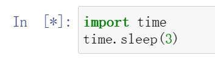
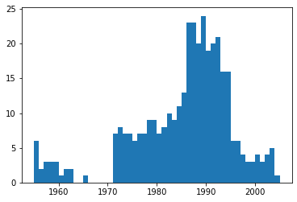

# 实验3 Notebook基础实践
## 1 创建一个新的NoteBook
在vscode中点击View->Command Palette，点击Create:New Jupyter Notebook，生成一个Untitled.ipynb文件  
  
在Notebook中有两个关键元素  
- cell
- kernal  

### cell
主要包含两种类型：
- code类型：包含可被kernel执行的代码，执行之后在下方显示输出。
- markdown类型：书写Markdown标记语言的cell。


```python
print('Hello World!')
```

    Hello World!
    

代码执行之后，cell左侧的标签从In [ ] 变成了 In [1]。In代表输入，[]中的数字代表kernel执行的顺序，而In [\*]则表示代码cell正在执行代码。以下例子显示了短暂的In [\*]过程。


```python
import time
time.sleep(3)
```



#### cell模式
有两种模式，编辑模式（edit mode）和命名模式（command mode）
- 编辑模式：enter健切换，绿色轮廓
- 命令模式：esc健切换，蓝色轮廓  

#### 常用快捷键
- 上下键头可以上下cell移动
- A或者B在上方或者下方插入一个cell
- M将转换代码cell为Markdown cell
- Y将设置活动cell为代码 cell
- D+D（两次）删除cell
- Z 撤销删除
- `Ctrl + Shift + -`将以光标处作为分割点，将cell一分为二。

### Kernel
每个notebook都基于一个内核运行，当执行cell代码时，代码将在内核当中运行，运行的结果会显示在页面上。Kernel中运行的状态在整个文档中是延续的，可以跨越所有的cell。这意思着在一个Notebook某个cell定义的函数或者变量等，在其他cell也可以使用。例如：


```python
import numpy as np
def square(x):
    return x * x
```

执行上述代码cell之后，后续cell可以使用np和square


```python
x = np.random.randint(1, 10)
y = square(x)
print('%d squared is %d' % (x, y))
```

    4 squared is 16
    

## 2 简单的python程序例子
### 定义selection_sort函数执行选择排序功能


```python
def selection_sort(arr):
    n = len(arr)
    for i in range(n-1):
        minIndex = i
        for j in range(i+1, n):
            if arr[j] < arr[minIndex]:
                minIndex = j
        arr[i], arr[minIndex] = arr[minIndex], arr[i]
    return arr
```

### 定义test函数进行测试
执行数据输入，并调用selection_sort，最后输出结果


```python
def test():
    arr = [3,2,5,1,7,8,6,4,9]
    selection_sort(arr)
    print(arr)

test()
```

    [1, 2, 3, 4, 5, 6, 7, 8, 9]
    

## 3 数据分析的例子
### 设置
导入相关的工具库


```python
%matplotlib inline
import pandas as pd
import matplotlib.pyplot as plt
import seaborn as sns
```

pandas用于数据处理，matplotlib用于绘图，seaborn使绘图更美观。第一行不是python命令，而被称为line magic。%表示作用与一行，%%表示作用于全文。此处%matplotlib inline 表示使用matlib画图，并将图片输出。

随后，加载数据集。


```python
df = pd.read_csv('fortune500.csv')
```

### 检查数据集
上述代码执行生成的df对象，是pandas常用的数据结构，称为DataFrame，可以理解为数据表。  
df.head()将会默认展示数据表的前5行


```python
df.head()
```


<div>
<table border="1" class="dataframe">
  <thead>
    <tr style="text-align: right;">
      <th></th>
      <th>Year</th>
      <th>Rank</th>
      <th>Company</th>
      <th>Revenue (in millions)</th>
      <th>Profit (in millions)</th>
    </tr>
  </thead>
  <tbody>
    <tr>
      <th>0</th>
      <td>1955</td>
      <td>1</td>
      <td>General Motors</td>
      <td>9823.5</td>
      <td>806</td>
    </tr>
    <tr>
      <th>1</th>
      <td>1955</td>
      <td>2</td>
      <td>Exxon Mobil</td>
      <td>5661.4</td>
      <td>584.8</td>
    </tr>
    <tr>
      <th>2</th>
      <td>1955</td>
      <td>3</td>
      <td>U.S. Steel</td>
      <td>3250.4</td>
      <td>195.4</td>
    </tr>
    <tr>
      <th>3</th>
      <td>1955</td>
      <td>4</td>
      <td>General Electric</td>
      <td>2959.1</td>
      <td>212.6</td>
    </tr>
    <tr>
      <th>4</th>
      <td>1955</td>
      <td>5</td>
      <td>Esmark</td>
      <td>2510.8</td>
      <td>19.1</td>
    </tr>
  </tbody>
</table>
</div>


df.tail()将会默认展示数据表的后5行


```python
df.tail()
```


<div>
<table border="1" class="dataframe">
  <thead>
    <tr style="text-align: right;">
      <th></th>
      <th>Year</th>
      <th>Rank</th>
      <th>Company</th>
      <th>Revenue (in millions)</th>
      <th>Profit (in millions)</th>
    </tr>
  </thead>
  <tbody>
    <tr>
      <th>25495</th>
      <td>2005</td>
      <td>496</td>
      <td>Wm. Wrigley Jr.</td>
      <td>3648.6</td>
      <td>493</td>
    </tr>
    <tr>
      <th>25496</th>
      <td>2005</td>
      <td>497</td>
      <td>Peabody Energy</td>
      <td>3631.6</td>
      <td>175.4</td>
    </tr>
    <tr>
      <th>25497</th>
      <td>2005</td>
      <td>498</td>
      <td>Wendy's International</td>
      <td>3630.4</td>
      <td>57.8</td>
    </tr>
    <tr>
      <th>25498</th>
      <td>2005</td>
      <td>499</td>
      <td>Kindred Healthcare</td>
      <td>3616.6</td>
      <td>70.6</td>
    </tr>
    <tr>
      <th>25499</th>
      <td>2005</td>
      <td>500</td>
      <td>Cincinnati Financial</td>
      <td>3614.0</td>
      <td>584</td>
    </tr>
  </tbody>
</table>
</div>


对数据属性列进行重命名，以便在后续访问


```python
df.columns = ['year', 'rank', 'company', 'revenue', 'profit']
```

len()函数将输出数据表的数据条目数量，可以用于检查数据是否加载完整


```python
len(df)
```


    25500


df.dtypes可以输出各属性列的数据类型


```python
df.dtypes
```


    year         int64
    rank         int64
    company     object
    revenue    float64
    profit      object
    dtype: object


对于profit属性，期待的结果为float类型，但由于dtypes的检查结果为object，所以可能包含非数字的值，故使用正则表达式进行检查。


```python
non_numberic_profits = df.profit.str.contains('[^0-9.-]')
df.loc[non_numberic_profits].head()
```


<div>
<table border="1" class="dataframe">
  <thead>
    <tr style="text-align: right;">
      <th></th>
      <th>year</th>
      <th>rank</th>
      <th>company</th>
      <th>revenue</th>
      <th>profit</th>
    </tr>
  </thead>
  <tbody>
    <tr>
      <th>228</th>
      <td>1955</td>
      <td>229</td>
      <td>Norton</td>
      <td>135.0</td>
      <td>N.A.</td>
    </tr>
    <tr>
      <th>290</th>
      <td>1955</td>
      <td>291</td>
      <td>Schlitz Brewing</td>
      <td>100.0</td>
      <td>N.A.</td>
    </tr>
    <tr>
      <th>294</th>
      <td>1955</td>
      <td>295</td>
      <td>Pacific Vegetable Oil</td>
      <td>97.9</td>
      <td>N.A.</td>
    </tr>
    <tr>
      <th>296</th>
      <td>1955</td>
      <td>297</td>
      <td>Liebmann Breweries</td>
      <td>96.0</td>
      <td>N.A.</td>
    </tr>
    <tr>
      <th>352</th>
      <td>1955</td>
      <td>353</td>
      <td>Minneapolis-Moline</td>
      <td>77.4</td>
      <td>N.A.</td>
    </tr>
  </tbody>
</table>
</div>


使用len()检查这样的记录共有多少条


```python
len(df.profit[non_numberic_profits])
```


    369


为了更直观的看到这样的非法记录在总体数据表中的占比，使用直方图观察每年的非法记录条目


```python
bin_sizes, _, _ = plt.hist(df.year[non_numberic_profits], bins=range(1955, 2006))
```


    

    


可见每个单独年份中的非法记录都少于25条，即少于4%的比例。这在可以接受的范围内，因此删除这些记录。


```python
df = df.loc[~non_numberic_profits]
df.profit = df.profit.apply(pd.to_numeric)
```

再次检查数据记录的条目数和各属性的数据类型


```python
len(df)
```


    25131


```python
df.dtypes
```


    year         int64
    rank         int64
    company     object
    revenue    float64
    profit     float64
    dtype: object


从数据类型可看出，无效非法数据记录已被清洗
### 使用matplotlib进行绘图
接下来，以年分组绘制平均利润和收入。首先定义变量和方法。


```python
group_by_year = df.loc[:, ['year', 'revenue', 'profit']].groupby('year')
avgs = group_by_year.mean()
x = avgs.index
y1 = avgs.profit
def plot(x, y, ax, title, y_label):
    ax.set_title(title)
    ax.set_ylabel(y_label)
    ax.plot(x, y)
    ax.margins(x=0, y=0)
```

使用matplotlib对平均利润进行绘图


```python
fig, ax = plt.subplots()
plot(x, y1, ax, 'Increase in mean Fortune 500 company profits from 1955 to 2005', 'Profit (millions)')
```


    

    


初期类似指数增长，但是1990年代初期出现急剧的下滑，对应当时经济衰退和网络泡沫。  
使用matplotlib对收入进行绘图


```python
y2 = avgs.revenue
fig, ax = plt.subplots()
plot(x, y2, ax, 'Increase in mean Fortune 500 company revenues from 1955 to 2005', 'Revenue (millions)')
```


    

    


对数据结果进行标准差处理，并绘图表现出来


```python
def plot_with_std(x, y, stds, ax, title, y_label):
    ax.fill_between(x, y - stds, y + stds, alpha=0.2)
    plot(x, y, ax, title, y_label)
fig, (ax1, ax2) = plt.subplots(ncols=2)
title = 'Increase in mean and std Fortune 500 company %s from 1955 to 2005'
stds1 = group_by_year.std().profit.values
stds2 = group_by_year.std().revenue.values
plot_with_std(x, y1.values, stds1, ax1, title % 'profits', 'Profit (millions)')
plot_with_std(x, y2.values, stds2, ax2, title % 'revenues', 'Revenue (millions)')
fig.set_size_inches(14, 4)
fig.tight_layout()
```


    

    


## 4 分享Notebooks
分享Notebooks通常来说一般存在两种形式：一种向本文一样以静态非交互式分享（html,markdown,pdf等）；另外一种通过Git版本工具或者Google Colab进行协同开发
### 分享之前的工作
分享的Notebooks应包括代码执行的输出，要保证执行的结果符合预期，需完成以下几件事：
- 点击"Cell > All Output > Clear"
- 点击"Kernel > Restart & Run All"
- 等待所有代码执行完毕   

这样做的目的使得Notebook不含有中间的执行结果，按照代码执行的顺序，产生稳定的结果。  

### 导出markdown文档
在官方提供的的Notebook服务器页面中打开所要分享的Notebook，点击File->Download as，可以选择多种导出格式，其中包括markdown文档格式：  

