# 实验4 实现图像分类APP
## 1 准备工作
### 下载初始代码
创建工作目录，在gitbash中输入命令  
`git clone https://github.com/hoitab/TFLClassify.git`  
将代码拷贝至本地
### 运行初始代码
在Android Studio中打开代码项目，等待Gradle构建，构建成功后，运行start模块  
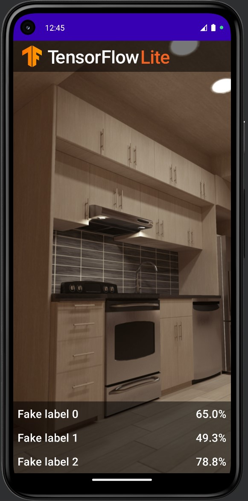

可以看到现在的界面中有三个虚假标签和各自的随机数，之后将用模型所识别出的花卉品种和对应概率将其替代
## 2 添加模型
选择“start”模块，点击File->New->Other->Tensorflow Lite Model  
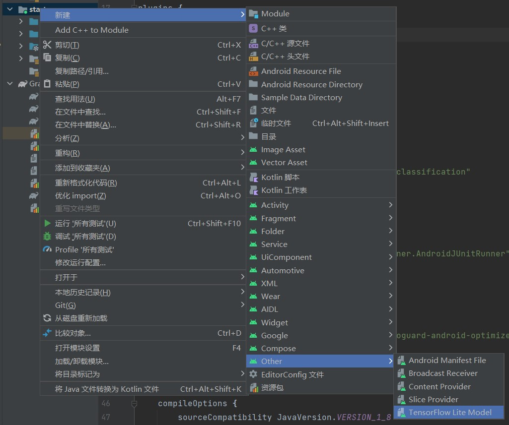  
选择“finish”模块中ml文件夹下的FlowerModel.tflite  
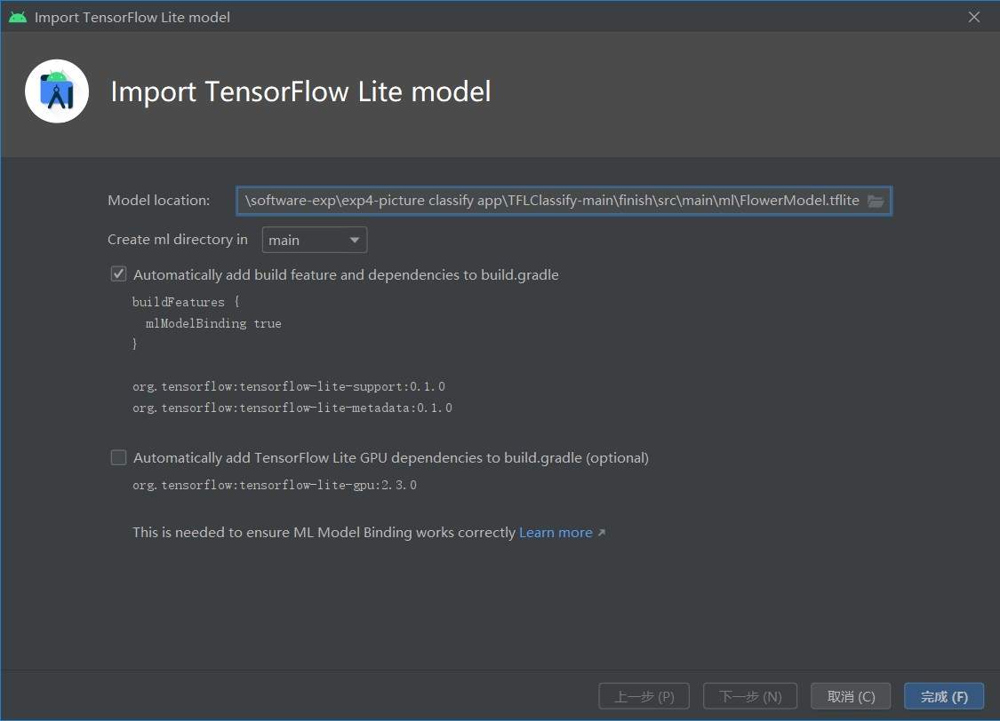  
系统将自动下载模型的依赖包并添加相关依赖项，并在模型成功导入后生成摘要信息  
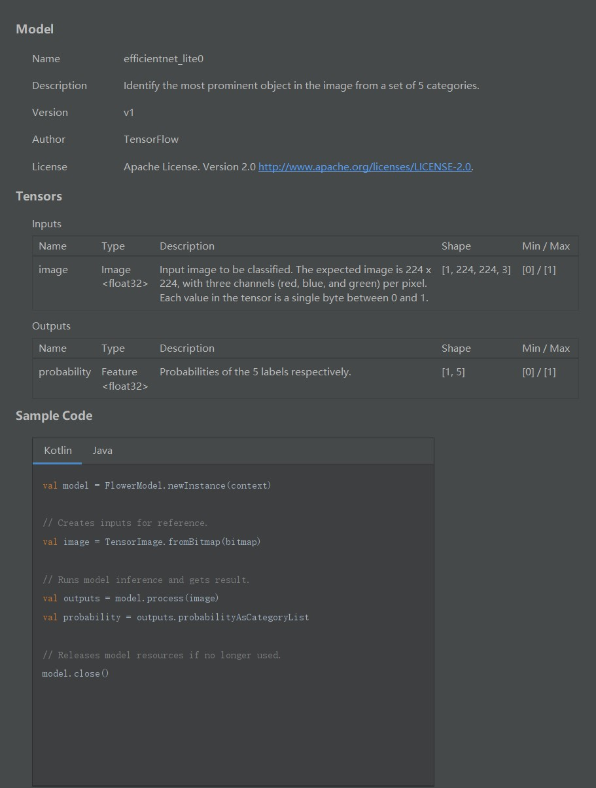
## 3 添加代码
### 检查代码中的TODO项
查看初始代码中的TODO列表视图，点击View->Tool Windows->TODO  
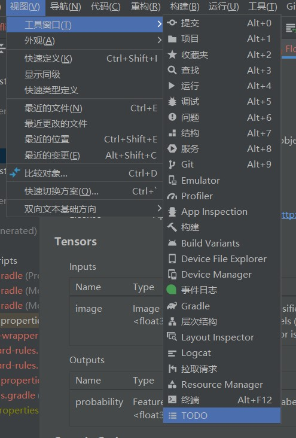  
选择按照模块分组TODO项，方便进一步查看  
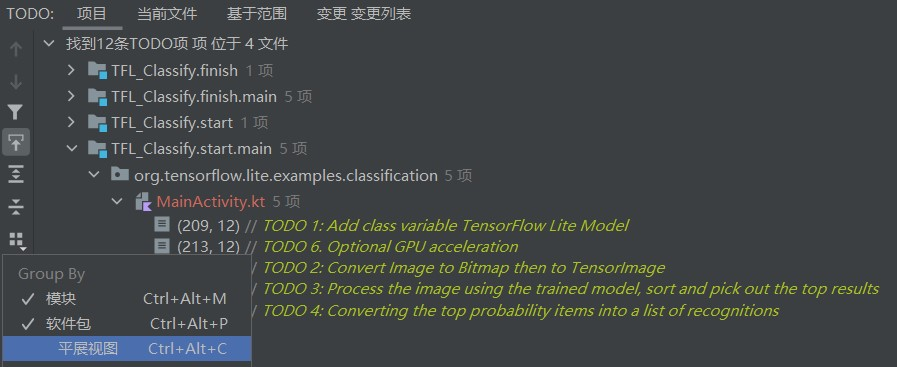
### 添加相应代码
1.定位到“start”模块MainActivity.kt文件的TODO 1处，添加初始化训练模型的代码
```java
private class ImageAnalyzer(ctx: Context, private val listener: RecognitionListener) :
        ImageAnalysis.Analyzer {
  ...
  // TODO 1: Add class variable TensorFlow Lite Model
  private val flowerModel = FlowerModel.newInstance(ctx)

  ...
}
```
2.定位至TODO 2处，在在CameraX的analyze方法内部，将摄像头的输入ImageProxy转化为Bitmap对象，并进一步转化为TensorImage对象
```java
override fun analyze(imageProxy: ImageProxy) {
  ...
  // TODO 2: Convert Image to Bitmap then to TensorImage
  val tfImage = TensorImage.fromBitmap(toBitmap(imageProxy))
  ...
}
```
3.定位至TODO 3处，对图像进行处理并生成结果
```java
override fun analyze(imageProxy: ImageProxy) {
  ...
  // TODO 3: Process the image using the trained model, sort and pick out the top results
  val outputs = flowerModel.process(tfImage)
      .probabilityAsCategoryList.apply {
          sortByDescending { it.score } // 结果按照概率排序
      }.take(MAX_RESULT_DISPLAY) // 显示概率最高的若干个结果
  ...
}
```
4.定位至TODO 4处，将识别的结果加入数据对象Recognition中，包含label和score两个元素，用于后续RecyclerView的数据显示
```java
override fun analyze(imageProxy: ImageProxy) {
  ...
  // TODO 4: Converting the top probability items into a list of recognitions
  for (output in outputs) {
      items.add(Recognition(output.label, output.score))
  }
  ...
}
```
5.将位于START和END中间，原先用于显示虚假标签的代码注释掉
```java
// START - Placeholder code at the start of the codelab. Comment this block of code out.
// for (i in 0..MAX_RESULT_DISPLAY-1){
//     items.add(Recognition("Fake label $i", Random.nextFloat()))
// }
// END - Placeholder code at the start of the codelab. Comment this block of code out.
```
## 4 实机运行
### USB连接实机
1.要在真机上运行软件，首先需要打开手机的开发者模式，以华为nova7，鸿蒙3.0系统为例。点击设置->关于手机，连续点击系统版本号，直到弹出消息提示进入开发者模式，回到上级菜单点击系统与更新->开发人员选项，在调试一栏找到USB调试开关，点击开启。
2.在Android studio的SDK manager中下载USB driver  
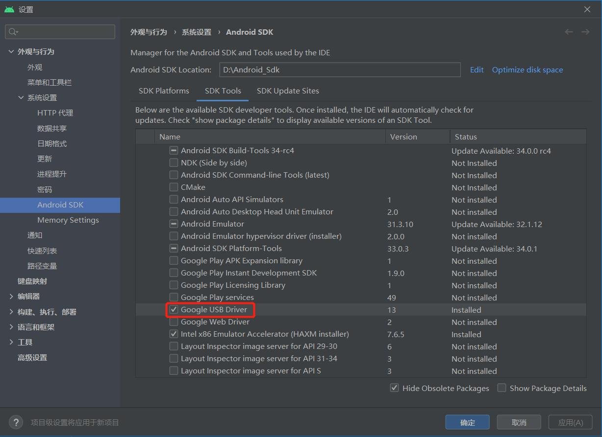  
3.使用数据线将真机连接到电脑，可以看到Android studio已经成功识别出真机，并可以在其上运行软件  
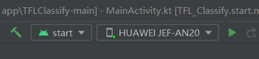
### 对于各花卉的识别效果
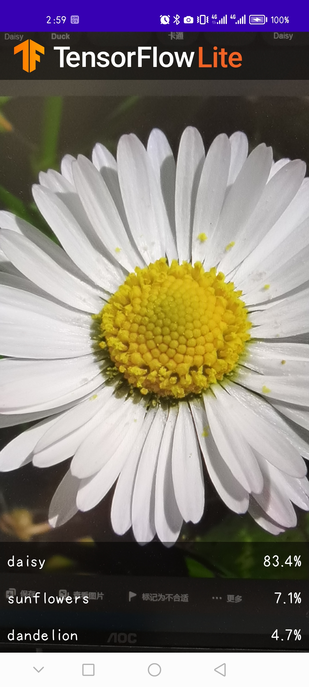
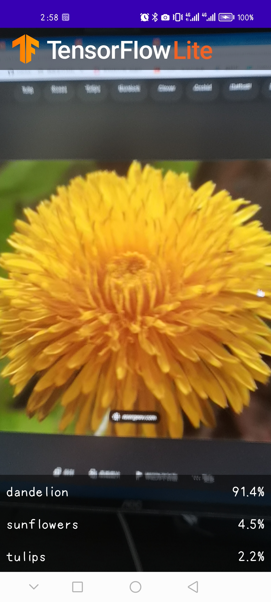
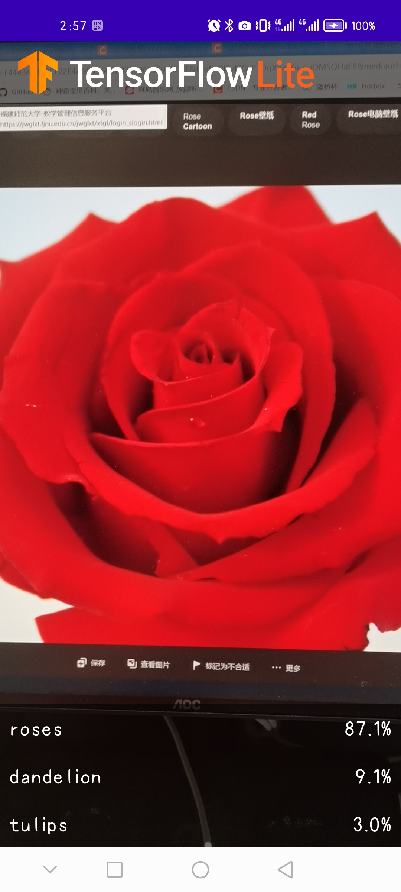
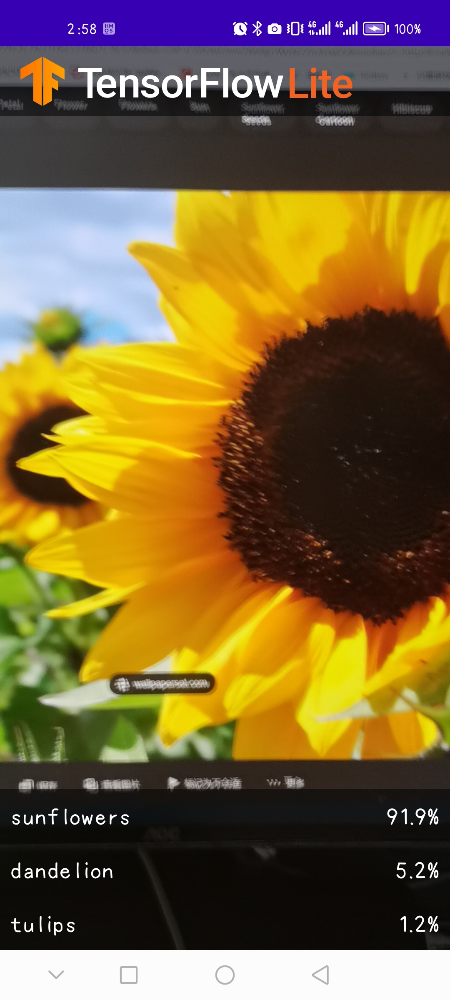
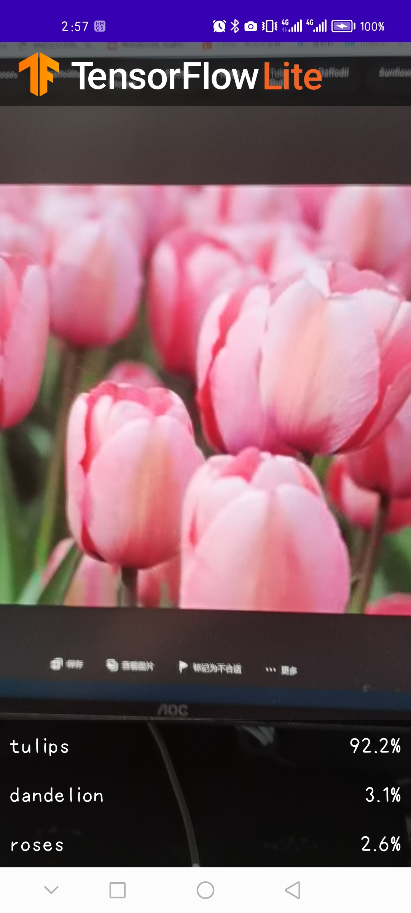

### 修改界面代码
更改标签的最大显示数量，设置为5
```java
// Constants
private const val MAX_RESULT_DISPLAY = 5 // Maximum number of results displayed
private const val TAG = "TFL Classify" // Name for logging
private const val REQUEST_CODE_PERMISSIONS = 999 // Return code after asking for permission
private val REQUIRED_PERMISSIONS = arrayOf(Manifest.permission.CAMERA) // permission needed
```
再次运行程序，会发现界面上显示了5种花卉标签及其对应概率  
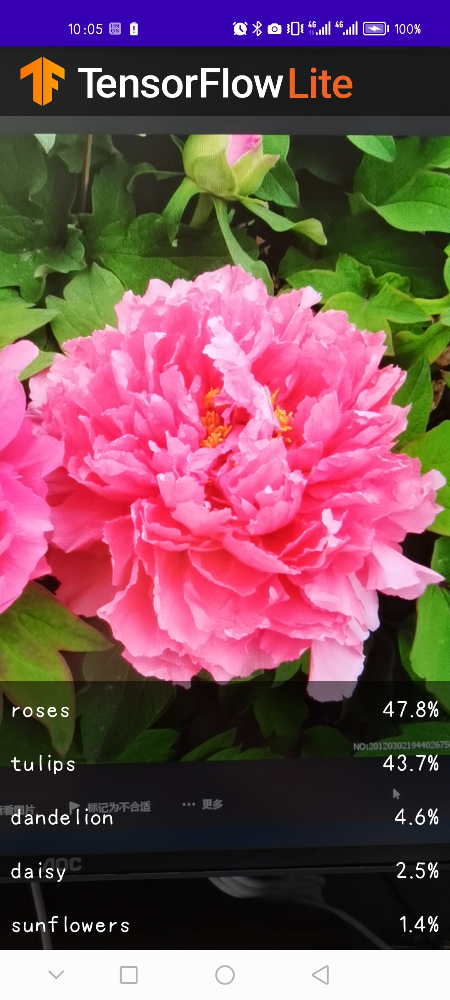