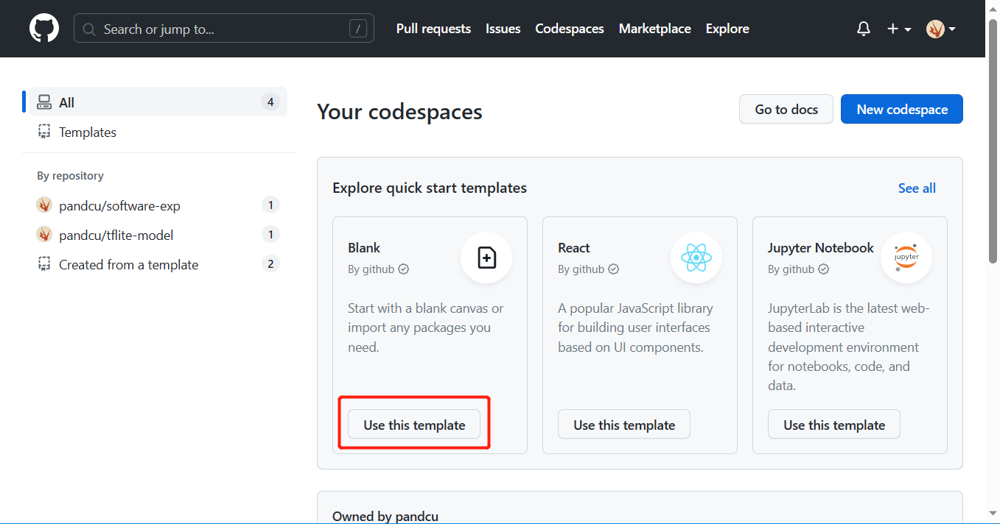
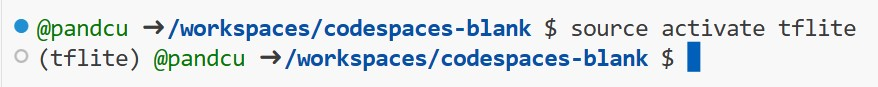
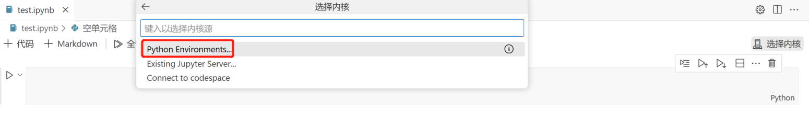
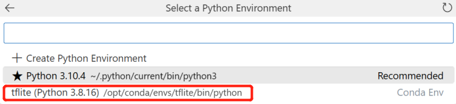
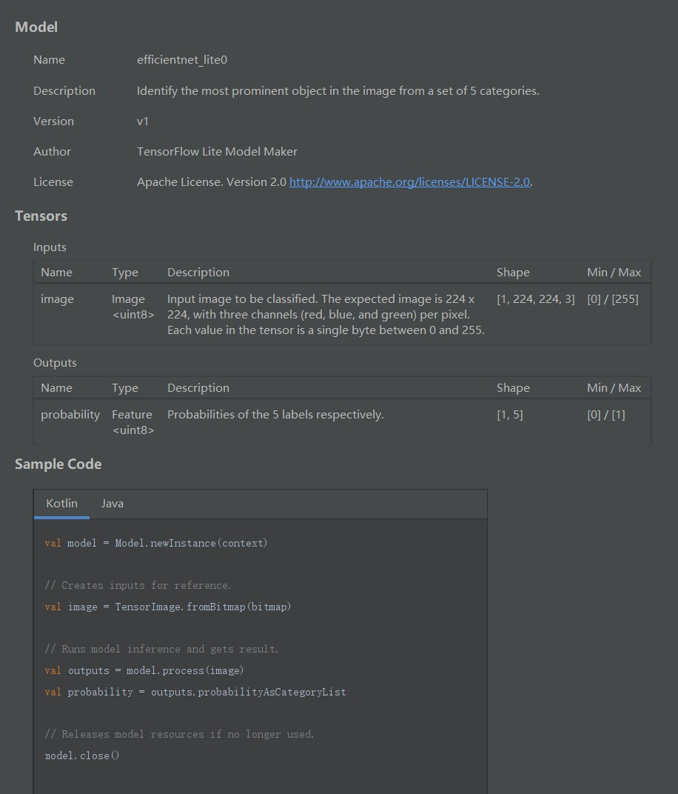

# 实验5 TensorFlow lite模型生成
## 1 准备工作
### 创建codesapce
在github提供的codespace环境里选择空白模板进行创建：  
  
在模板工程中新建一个Jupyter notebook文件，后缀名为.ipynb。
### 配置环境
1.在终端输入命令，创建一个名为tflite的环境，并指定python版本为3.8  
`conda create -n tflite python=3.8`  
2.codespace是基于 Ubuntu Linux 映像创建的，输入`source activate tflite`命令激活刚刚创建的虚拟环境  
  
3.输入命令安装tflite-model-maker库  
`pip install tflite-model-maker`  
该命令将自动下载tflite-model-maker及其相关依赖库，等待一段时间直到安装完成。  
4.在notebook中选择在上述步骤中创建的tflite环境作为kernel  
  
  
### 环境调试
测试环境中的库能否正常使用，在notobook中输入：
```python
import tensorflow
import tflite_model_maker
```
点击运行，产生如下报错信息:
```
AttributeError: module 'numpy' has no attribute 'object'.
`np.object` was a deprecated alias for the builtin `object`. To avoid this error in existing code, use `object` by itself. Doing this will not modify any behavior and is safe. 
The aliases was originally deprecated in NumPy 1.20; for more details and guidance see the original release note at:
    https://numpy.org/devdocs/release/1.20.0-notes.html#deprecations
```
由报错信息可知是numpy库版本过高引起，查阅资料找到合适的版本号，输入命令：  
`pip install numpy==1.23.4`  
待numpy库重新安装后，点击restart重启内核，再次运行程序，先前的错误已经解决，但是出现了新的报错信息：
```
ImportError: libusb-1.0.so.0: cannot open shared object file: No such file or directory
```
在终端内依次输入命令：  
`sudo apt-get update`  
`sudo apt-get install libusb-1.0-0-dev`  
等待下载完成后，再次运行程序，成功运行无报错。  

至此，准备工作全部顺利完成。


## 2 模型训练
### 导入相关库


```python
import os

import numpy as np

import tensorflow as tf
assert tf.__version__.startswith('2')

from tflite_model_maker import model_spec
from tflite_model_maker import image_classifier
from tflite_model_maker.config import ExportFormat
from tflite_model_maker.config import QuantizationConfig
from tflite_model_maker.image_classifier import DataLoader

import matplotlib.pyplot as plt
```

    2023-05-18 00:52:58.514199: W tensorflow/stream_executor/platform/default/dso_loader.cc:64] Could not load dynamic library 'libcudart.so.11.0'; dlerror: libcudart.so.11.0: cannot open shared object file: No such file or directory
    2023-05-18 00:52:58.514245: I tensorflow/stream_executor/cuda/cudart_stub.cc:29] Ignore above cudart dlerror if you do not have a GPU set up on your machine.
    /opt/conda/envs/tflite/lib/python3.8/site-packages/tensorflow_addons/utils/tfa_eol_msg.py:23: UserWarning: 
    
    TensorFlow Addons (TFA) has ended development and introduction of new features.
    TFA has entered a minimal maintenance and release mode until a planned end of life in May 2024.
    Please modify downstream libraries to take dependencies from other repositories in our TensorFlow community (e.g. Keras, Keras-CV, and Keras-NLP). 
    
    For more information see: https://github.com/tensorflow/addons/issues/2807 
    
      warnings.warn(
    /opt/conda/envs/tflite/lib/python3.8/site-packages/tensorflow_addons/utils/ensure_tf_install.py:53: UserWarning: Tensorflow Addons supports using Python ops for all Tensorflow versions above or equal to 2.10.0 and strictly below 2.13.0 (nightly versions are not supported). 
     The versions of TensorFlow you are currently using is 2.8.4 and is not supported. 
    Some things might work, some things might not.
    If you were to encounter a bug, do not file an issue.
    If you want to make sure you're using a tested and supported configuration, either change the TensorFlow version or the TensorFlow Addons's version. 
    You can find the compatibility matrix in TensorFlow Addon's readme:
    https://github.com/tensorflow/addons
      warnings.warn(
    /opt/conda/envs/tflite/lib/python3.8/site-packages/tqdm/auto.py:21: TqdmWarning: IProgress not found. Please update jupyter and ipywidgets. See https://ipywidgets.readthedocs.io/en/stable/user_install.html
      from .autonotebook import tqdm as notebook_tqdm
    

### 获取数据集
从storage.googleapis.com中下载所需的数据集：


```python
image_path = tf.keras.utils.get_file(
      'flower_photos.tgz',
      'https://storage.googleapis.com/download.tensorflow.org/example_images/flower_photos.tgz',
      extract=True)
image_path = os.path.join(os.path.dirname(image_path), 'flower_photos')
```

### 训练步骤
1.加载数据集，并将数据集分为训练数据和测试数据


```python
data = DataLoader.from_folder(image_path)
train_data, test_data = data.split(0.9)
```

    INFO:tensorflow:Load image with size: 3670, num_label: 5, labels: daisy, dandelion, roses, sunflowers, tulips.
    

    2023-05-18 00:53:24.637612: W tensorflow/stream_executor/platform/default/dso_loader.cc:64] Could not load dynamic library 'libcuda.so.1'; dlerror: libcuda.so.1: cannot open shared object file: No such file or directory; LD_LIBRARY_PATH: /opt/conda/envs/tflite/lib/python3.8/site-packages/cv2/../../lib64:
    2023-05-18 00:53:24.637659: W tensorflow/stream_executor/cuda/cuda_driver.cc:269] failed call to cuInit: UNKNOWN ERROR (303)
    2023-05-18 00:53:24.637692: I tensorflow/stream_executor/cuda/cuda_diagnostics.cc:156] kernel driver does not appear to be running on this host (codespaces-db1f27): /proc/driver/nvidia/version does not exist
    2023-05-18 00:53:24.658681: I tensorflow/core/platform/cpu_feature_guard.cc:151] This TensorFlow binary is optimized with oneAPI Deep Neural Network Library (oneDNN) to use the following CPU instructions in performance-critical operations:  AVX2 AVX512F FMA
    To enable them in other operations, rebuild TensorFlow with the appropriate compiler flags.
    

2.训练图像分类模型


```python
model = image_classifier.create(train_data)
```

    INFO:tensorflow:Retraining the models...
    Model: "sequential"
    _________________________________________________________________
     Layer (type)                Output Shape              Param #   
    =================================================================
     hub_keras_layer_v1v2 (HubKe  (None, 1280)             3413024   
     rasLayerV1V2)                                                   
                                                                     
     dropout (Dropout)           (None, 1280)              0         
                                                                     
     dense (Dense)               (None, 5)                 6405      
                                                                     
    =================================================================
    Total params: 3,419,429
    Trainable params: 6,405
    Non-trainable params: 3,413,024
    _________________________________________________________________
    None
    Epoch 1/5
    

    2023-05-18 00:53:34.604854: W tensorflow/core/framework/cpu_allocator_impl.cc:82] Allocation of 51380224 exceeds 10% of free system memory.
    2023-05-18 00:53:34.920458: W tensorflow/core/framework/cpu_allocator_impl.cc:82] Allocation of 51380224 exceeds 10% of free system memory.
    2023-05-18 00:53:34.955111: W tensorflow/core/framework/cpu_allocator_impl.cc:82] Allocation of 51380224 exceeds 10% of free system memory.
    2023-05-18 00:53:34.982523: W tensorflow/core/framework/cpu_allocator_impl.cc:82] Allocation of 25690112 exceeds 10% of free system memory.
    2023-05-18 00:53:35.000047: W tensorflow/core/framework/cpu_allocator_impl.cc:82] Allocation of 154140672 exceeds 10% of free system memory.
    

    103/103 [==============================] - 62s 581ms/step - loss: 0.8758 - accuracy: 0.7643
    Epoch 2/5
    103/103 [==============================] - 59s 576ms/step - loss: 0.6580 - accuracy: 0.8862
    Epoch 3/5
    103/103 [==============================] - 60s 577ms/step - loss: 0.6205 - accuracy: 0.9144
    Epoch 4/5
    103/103 [==============================] - 59s 574ms/step - loss: 0.6020 - accuracy: 0.9251
    Epoch 5/5
    103/103 [==============================] - 60s 576ms/step - loss: 0.5884 - accuracy: 0.9308
    

3.评估模型


```python
loss, accuracy = model.evaluate(test_data)
```

    12/12 [==============================] - 9s 540ms/step - loss: 0.6214 - accuracy: 0.9183
    

4.在当前目录下，导出为TensorFlow lite模型


```python
model.export(export_dir='.')
```

    2023-05-18 00:59:18.261353: W tensorflow/python/util/util.cc:368] Sets are not currently considered sequences, but this may change in the future, so consider avoiding using them.
    

    INFO:tensorflow:Assets written to: /tmp/tmpo3yocq6n/assets
    

    INFO:tensorflow:Assets written to: /tmp/tmpo3yocq6n/assets
    2023-05-18 00:59:22.793664: I tensorflow/core/grappler/devices.cc:66] Number of eligible GPUs (core count >= 8, compute capability >= 0.0): 0
    2023-05-18 00:59:22.793852: I tensorflow/core/grappler/clusters/single_machine.cc:358] Starting new session
    2023-05-18 00:59:22.871617: I tensorflow/core/grappler/optimizers/meta_optimizer.cc:1164] Optimization results for grappler item: graph_to_optimize
      function_optimizer: Graph size after: 913 nodes (656), 923 edges (664), time = 37.756ms.
      function_optimizer: function_optimizer did nothing. time = 0.014ms.
    
    /opt/conda/envs/tflite/lib/python3.8/site-packages/tensorflow/lite/python/convert.py:746: UserWarning: Statistics for quantized inputs were expected, but not specified; continuing anyway.
      warnings.warn("Statistics for quantized inputs were expected, but not "
    2023-05-18 00:59:24.089944: W tensorflow/compiler/mlir/lite/python/tf_tfl_flatbuffer_helpers.cc:357] Ignored output_format.
    2023-05-18 00:59:24.090000: W tensorflow/compiler/mlir/lite/python/tf_tfl_flatbuffer_helpers.cc:360] Ignored drop_control_dependency.
    

    INFO:tensorflow:Label file is inside the TFLite model with metadata.
    

    fully_quantize: 0, inference_type: 6, input_inference_type: 3, output_inference_type: 3
    INFO:tensorflow:Label file is inside the TFLite model with metadata.
    

    INFO:tensorflow:Saving labels in /tmp/tmpi4bvxnw6/labels.txt
    

    INFO:tensorflow:Saving labels in /tmp/tmpi4bvxnw6/labels.txt
    

    INFO:tensorflow:TensorFlow Lite model exported successfully: ./model.tflite
    

    INFO:tensorflow:TensorFlow Lite model exported successfully: ./model.tflite
    

## 3 模型验证
将本次训练得到的模型导入到实验4的程序中，替换之前的成品模型  
  
运行程序，可以正常识别花卉
