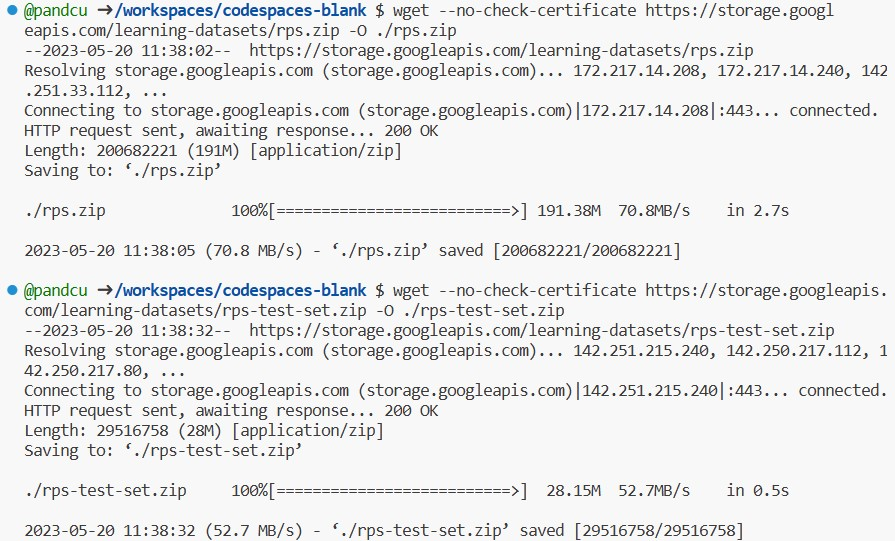
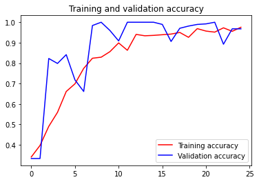

# 实验5_2 TensorFlow 石头剪刀布模型生成
## 1 准备工作
### 下载数据集
在终端内输入命令，将石头剪刀布的训练集和测试集下载至当前目录：  
`wget --no-check-certificate https://storage.googleapis.com/learning-datasets/rps.zip -O ./rps.zip`  
`wget --no-check-certificate https://storage.googleapis.com/learning-datasets/rps-test-set.zip -O ./rps-test-set.zip`  


解压数据集至当前目录：


```python
import os
import zipfile

local_zip = './rps.zip'
zip_ref = zipfile.ZipFile(local_zip, 'r')
zip_ref.extractall('./')
zip_ref.close()

local_zip = './rps-test-set.zip'
zip_ref = zipfile.ZipFile(local_zip, 'r')
zip_ref.extractall('./')
zip_ref.close()
```

### 验证数据集
打印数据集的相关信息以验证数据集的完整性


```python
rock_dir = os.path.join('./rps/rock')
paper_dir = os.path.join('./rps/paper')
scissors_dir = os.path.join('./rps/scissors')

# 各手势数据集包含的图片张数
print('total training rock images:', len(os.listdir(rock_dir)))
print('total training paper images:', len(os.listdir(paper_dir)))
print('total training scissors images:', len(os.listdir(scissors_dir)))

# 输出各数据集的前5张图片的文件名
rock_file = os.listdir(rock_dir)
rock_file.sort()
print(rock_file[:5])
paper_file = os.listdir(paper_dir)
paper_file.sort()
print(paper_file[:5])
scissors_file = os.listdir(scissors_dir)
scissors_file.sort()
print(scissors_file[:5])
```

    total training rock images: 840
    total training paper images: 840
    total training scissors images: 840
    ['rock01-000.png', 'rock01-001.png', 'rock01-002.png', 'rock01-003.png', 'rock01-004.png']
    ['paper01-000.png', 'paper01-001.png', 'paper01-002.png', 'paper01-003.png', 'paper01-004.png']
    ['scissors01-000.png', 'scissors01-001.png', 'scissors01-002.png', 'scissors01-003.png', 'scissors01-004.png']
    

从石头、剪刀、布训练集中分别打印两张图片


```python
%matplotlib inline
import matplotlib.pyplot as plt
import matplotlib.image as mpimg

pic_index = 100

next_rock = [os.path.join(rock_dir, fname)
         for fname in rock_file[pic_index-2:pic_index]]
next_paper = [os.path.join(paper_dir, fname)
         for fname in paper_file[pic_index-2:pic_index]]
next_scissors = [os.path.join(scissors_dir, fname)
         for fname in scissors_file[pic_index-2:pic_index]]

for i, img_path in enumerate(next_rock + next_paper + next_scissors):
    img = mpimg.imread(img_path)
    plt.imshow(img)
    plt.axis('Off')
    plt.show()
```


    

    


    

    


    

    


    

    


    

    


    

    


## 2 模型生成
调用TensorFlow的keras进行数据模型的训练，ImageDataGenerator是Keras中图像预处理的类，经过预处理使得后续的训练更加准确。


```python
import tensorflow as tf
import keras_preprocessing
from keras_preprocessing import image
from keras_preprocessing.image import ImageDataGenerator

TRAINING_DIR = './rps/'
# 图片预处理
training_datagen = ImageDataGenerator(
    rescale=1./255,
    rotation_range=40,
    width_shift_range=0.2,
    height_shift_range=0.2,
    shear_range=0.2,
    zoom_range=0.2,
    horizontal_flip=True,
    fill_mode='nearest'
)

VALIDATION_DIR = "./rps-test-set/"
validation_datagen = ImageDataGenerator(rescale = 1./255)

train_generator = training_datagen.flow_from_directory(
    TRAINING_DIR,
    target_size=(150,150),
    class_mode='categorical',
    batch_size=126
)

validation_generator = validation_datagen.flow_from_directory(
    VALIDATION_DIR,
    target_size=(150,150),
    class_mode='categorical',
    batch_size=126
)

# 定义模型架构
model = tf.keras.models.Sequential([
    # Note the input shape is the desired size of the image 150x150 with 3 bytes color
    # This is the first convolution
    tf.keras.layers.Conv2D(64, (3,3), activation='relu', input_shape=(150, 150, 3)),
    tf.keras.layers.MaxPooling2D(2, 2),
    # The second convolution
    tf.keras.layers.Conv2D(64, (3,3), activation='relu'),
    tf.keras.layers.MaxPooling2D(2,2),
    # The third convolution
    tf.keras.layers.Conv2D(128, (3,3), activation='relu'),
    tf.keras.layers.MaxPooling2D(2,2),
    # The fourth convolution
    tf.keras.layers.Conv2D(128, (3,3), activation='relu'),
    tf.keras.layers.MaxPooling2D(2,2),
    # Flatten the results to feed into a DNN
    tf.keras.layers.Flatten(),
    tf.keras.layers.Dropout(0.5),
    # 512 neuron hidden layer
    tf.keras.layers.Dense(512, activation='relu'),
    tf.keras.layers.Dense(3, activation='softmax')
])

model.summary()

# 编译模型并定义相关参数
model.compile(loss = 'categorical_crossentropy', optimizer = 'rmsprop', metrics = ['accuracy'])

# 用训练数据拟合
history = model.fit(train_generator, epochs=25, steps_per_epoch=20, validation_data = validation_generator, verbose = 1, validation_steps=3)

```

    Found 2520 images belonging to 3 classes.
    Found 372 images belonging to 3 classes.
    Model: "sequential_1"
    _________________________________________________________________
    Layer (type)                 Output Shape              Param #   
    =================================================================
    conv2d_4 (Conv2D)            (None, 148, 148, 64)      1792      
    _________________________________________________________________
    max_pooling2d_4 (MaxPooling2 (None, 74, 74, 64)        0         
    _________________________________________________________________
    conv2d_5 (Conv2D)            (None, 72, 72, 64)        36928     
    _________________________________________________________________
    max_pooling2d_5 (MaxPooling2 (None, 36, 36, 64)        0         
    _________________________________________________________________
    conv2d_6 (Conv2D)            (None, 34, 34, 128)       73856     
    _________________________________________________________________
    max_pooling2d_6 (MaxPooling2 (None, 17, 17, 128)       0         
    _________________________________________________________________
    conv2d_7 (Conv2D)            (None, 15, 15, 128)       147584    
    _________________________________________________________________
    max_pooling2d_7 (MaxPooling2 (None, 7, 7, 128)         0         
    _________________________________________________________________
    flatten_1 (Flatten)          (None, 6272)              0         
    _________________________________________________________________
    dropout_1 (Dropout)          (None, 6272)              0         
    _________________________________________________________________
    dense_2 (Dense)              (None, 512)               3211776   
    _________________________________________________________________
    dense_3 (Dense)              (None, 3)                 1539      
    =================================================================
    Total params: 3,473,475
    Trainable params: 3,473,475
    Non-trainable params: 0
    _________________________________________________________________
    Epoch 1/25
    20/20 [==============================] - 52s 3s/step - loss: 1.5474 - accuracy: 0.3409 - val_loss: 1.0911 - val_accuracy: 0.3333
    Epoch 2/25
    20/20 [==============================] - 52s 3s/step - loss: 1.0790 - accuracy: 0.3972 - val_loss: 1.1172 - val_accuracy: 0.3333
    Epoch 3/25
    20/20 [==============================] - 51s 3s/step - loss: 1.0438 - accuracy: 0.4905 - val_loss: 0.7192 - val_accuracy: 0.8226
    Epoch 4/25
    20/20 [==============================] - 51s 3s/step - loss: 0.9123 - accuracy: 0.5591 - val_loss: 0.5153 - val_accuracy: 0.7984
    Epoch 5/25
    20/20 [==============================] - 51s 3s/step - loss: 0.7418 - accuracy: 0.6611 - val_loss: 0.5676 - val_accuracy: 0.8414
    Epoch 6/25
    20/20 [==============================] - 51s 3s/step - loss: 0.6711 - accuracy: 0.6988 - val_loss: 0.4470 - val_accuracy: 0.7177
    Epoch 7/25
    20/20 [==============================] - 51s 3s/step - loss: 0.6024 - accuracy: 0.7742 - val_loss: 0.5959 - val_accuracy: 0.6613
    Epoch 8/25
    20/20 [==============================] - 52s 3s/step - loss: 0.4299 - accuracy: 0.8238 - val_loss: 0.1031 - val_accuracy: 0.9839
    Epoch 9/25
    20/20 [==============================] - 52s 3s/step - loss: 0.4307 - accuracy: 0.8290 - val_loss: 0.0611 - val_accuracy: 1.0000
    Epoch 10/25
    20/20 [==============================] - 51s 3s/step - loss: 0.3586 - accuracy: 0.8560 - val_loss: 0.1167 - val_accuracy: 0.9597
    Epoch 11/25
    20/20 [==============================] - 51s 3s/step - loss: 0.2875 - accuracy: 0.8988 - val_loss: 0.1764 - val_accuracy: 0.9086
    Epoch 12/25
    20/20 [==============================] - 51s 3s/step - loss: 0.3550 - accuracy: 0.8627 - val_loss: 0.1168 - val_accuracy: 1.0000
    Epoch 13/25
    20/20 [==============================] - 51s 3s/step - loss: 0.1777 - accuracy: 0.9405 - val_loss: 0.0309 - val_accuracy: 1.0000
    Epoch 14/25
    20/20 [==============================] - 52s 3s/step - loss: 0.1880 - accuracy: 0.9337 - val_loss: 0.0488 - val_accuracy: 1.0000
    Epoch 15/25
    20/20 [==============================] - 52s 3s/step - loss: 0.1686 - accuracy: 0.9357 - val_loss: 0.0302 - val_accuracy: 1.0000
    Epoch 16/25
    20/20 [==============================] - 51s 3s/step - loss: 0.1722 - accuracy: 0.9389 - val_loss: 0.0577 - val_accuracy: 0.9892
    Epoch 17/25
    20/20 [==============================] - 51s 3s/step - loss: 0.1509 - accuracy: 0.9421 - val_loss: 0.1404 - val_accuracy: 0.9059
    Epoch 18/25
    20/20 [==============================] - 51s 3s/step - loss: 0.1507 - accuracy: 0.9500 - val_loss: 0.0630 - val_accuracy: 0.9704
    Epoch 19/25
    20/20 [==============================] - 52s 3s/step - loss: 0.2047 - accuracy: 0.9262 - val_loss: 0.0515 - val_accuracy: 0.9812
    Epoch 20/25
    20/20 [==============================] - 52s 3s/step - loss: 0.0866 - accuracy: 0.9687 - val_loss: 0.0531 - val_accuracy: 0.9892
    Epoch 21/25
    20/20 [==============================] - 52s 3s/step - loss: 0.1140 - accuracy: 0.9567 - val_loss: 0.0329 - val_accuracy: 0.9919
    Epoch 22/25
    20/20 [==============================] - 51s 3s/step - loss: 0.1305 - accuracy: 0.9516 - val_loss: 0.0241 - val_accuracy: 1.0000
    Epoch 23/25
    20/20 [==============================] - 52s 3s/step - loss: 0.0875 - accuracy: 0.9726 - val_loss: 0.2168 - val_accuracy: 0.8925
    Epoch 24/25
    20/20 [==============================] - 52s 3s/step - loss: 0.1476 - accuracy: 0.9556 - val_loss: 0.0740 - val_accuracy: 0.9677
    Epoch 25/25
    20/20 [==============================] - 53s 3s/step - loss: 0.0698 - accuracy: 0.9754 - val_loss: 0.0670 - val_accuracy: 0.9677
    

将生成的模型以h5格式保存到当前目录


```python
model.save("rps.h5")
```

## 3 模型评估
通过绘制图形的方式，验证生成模型的性能


```python
import matplotlib.pyplot as plt
acc = history.history['accuracy']
val_acc = history.history['val_accuracy']
loss = history.history['loss']
val_loss = history.history['val_loss']

epochs = range(len(acc))

plt.plot(epochs, acc, 'r', label='Training accuracy')
plt.plot(epochs, val_acc, 'b', label='Validation accuracy')
plt.title('Training and validation accuracy')
plt.legend(loc=0)
plt.figure()
plt.show()
```


    

    


    <Figure size 432x288 with 0 Axes>

